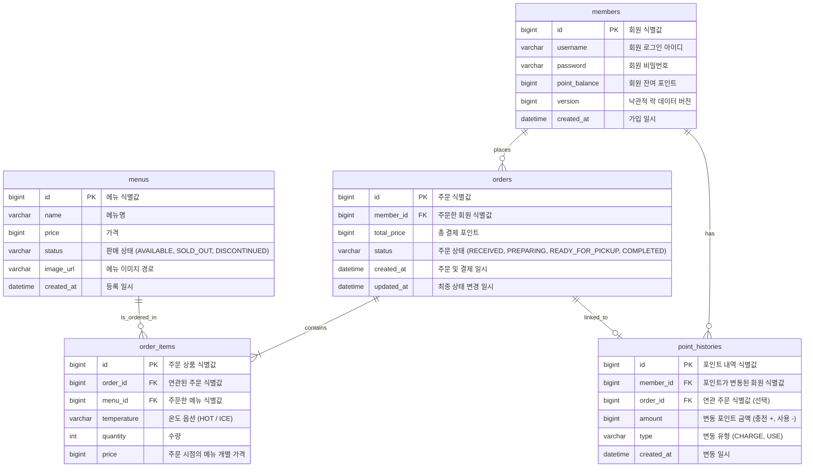

# 📊 jeonscafe 데이터베이스 ERD 설계서

본 문서는 커피숍 주문 시스템(`jeonscafe`)의 데이터 모델링 결과를 보여주는 ERD 설계서입니다. 모든 테이블명은 프로젝트 컨벤션에 따라 **복수형 명사**로 정의되었습니다.

---

## 1. 🗺️ ERD (Entity Relationship Diagram)

---

## 2. 🗂️ 테이블 상세 명세

### ① `members` (회원 테이블)
* **`id` (PK)**: 회원 식별 고유키
* **`point_balance`**: 잔여 포인트 정보
* **`version`**: **[P1 반영]** 동시성 제어(Lost Update)를 위한 낙관적 락 데이터 버전 컬럼. 중복 결제 및 다중 요청에 의한 잔액 꼬임 현상을 방지합니다.

### ② `menus` (커피 메뉴 테이블)
* **`id` (PK)**: 메뉴 식별 고유키
* **`status`**: **[P2 반영]** 상품 판매 상태 관리 컬럼 (`AVAILABLE`[판매중], `SOLD_OUT`[품절], `DISCONTINUED`[단종]). 
  * 메뉴가 더 이상 제공되지 않더라도 실제 DB에서 `DELETE`하지 않고 상태값 변경을 처리하여 과거 주문 정보(`order_items`)와의 외래키(FK) 참조 무결성을 안전하게 지켜냅니다.

### ③ `orders` (주문 정보 테이블)
* **`id` (PK)**: 주문 식별 고유키 (주문 번호)
* **`updated_at`**: **[P2 반영]** 최종 상태 변경 일시. 
  * 주문 상태(`RECEIVED` -> `PREPARING` -> `READY_FOR_PICKUP` -> `COMPLETED`)의 상태 추이 및 변경 시간 히스토리를 정밀하게 추적하고 분석하기 위함입니다.

### ④ `order_items` (주문 상품 상세 테이블)
* **`id` (PK)**: 주문 개별 상품 일련번호
* **`price`**: 주문 시점의 커피 가격 기록 (이후 `menus` 테이블에서 판매 가격이 바뀌어도 과거 결제 이력 보존용)

### ⑤ `point_histories` (포인트 충전/사용 이력 테이블)
* **`id` (PK)**: 포인트 변동 이력 고유키
* **`order_id` (FK, Null 허용)**: **[P3 반영]** 포인트가 차감되었을 때 연관된 주문 번호(`orders.id`)를 저장합니다.
  * 고객의 포인트 사용(차감) 내역이 어떤 결제 건에 해당되는지 역추적 조회를 수월하게 도와줍니다. (단, 포인트 충전 시에는 `Null` 처리)

---

## 3. ⚡ 인덱스(Index) 설계 전략 (성능 최적화)

### `idx_orders_created_at` (orders 테이블의 created_at 컬럼)
* **[P3 반영]**: 인기 메뉴 목록 조회 API (`GET /menu/popular`) 호출 시, **"최근 7일간 주문이 가장 많은 상위 3개 메뉴"**를 집계해야 합니다.
* 데이터가 무수히 쌓였을 때 전체 데이터를 다 훑는 풀 스캔(Full Scan) 현상을 방지하기 위해 `orders.created_at` 컬럼에 단일 인덱스(Index)를 적용하여 날짜 조건절 검색 속도 및 조인 성능을 최적화합니다.
