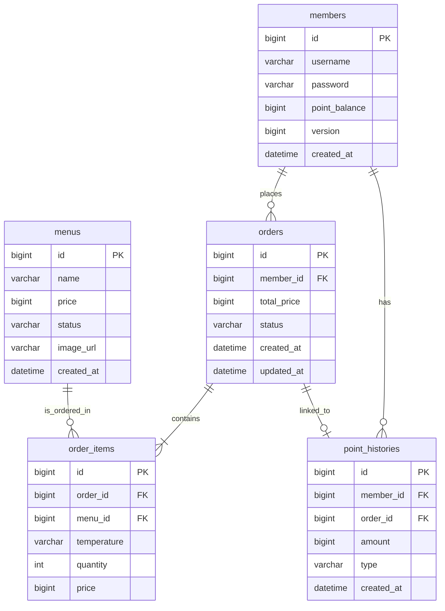

# jeonscafe 커피숍 주문 시스템

본 프로젝트는 스프링 부트(Spring Boot)와 JPA를 기반으로 구축된 분산 환경 친화적인 커피숍 주문 및 결제 시스템입니다. 안전한 포인트 기반 결제 시스템과 동시성 제어 기술을 특징으로 합니다.

---

## 관련 문서 바로가기
- [요구사항 정의서 (REQUIREMENTS.md)](./REQUIREMENTS.md)
- [데이터베이스 ERD 설계서 (ERD.md)](./ERD.md)
- [REST API 상세 명세서 (API.md)](./API.md)
- [프로젝트 공통 컨벤션 (CONVENTION.md)](./CONVENTION.md)
- [개발 도움말 (HELP.md)](./HELP.md)

---

## 기술 스택 (Tech Stack)
- **개발 언어**: Java 17
- **프레임워크**: Spring Boot 4.1.0, Spring Data JPA
- **데이터베이스**: H2 Database (인메모리 디비)
- **빌드 도구**: Gradle

---

## 주요 비즈니스 정책
- **포인트 결제**: 결제는 오직 포인트로만 처리되며 1원 = 1P로 1대1 매핑됩니다. 잔여 포인트를 확인하여 차감합니다.
- **동시성 제어**: 포인트 결제 및 차감 시 낙관적 락(Optimistic Lock)을 활용하여 포인트 잔액 꼬임 현상 및 중복 결제를 원천 방지합니다.
- **실시간 데이터 송신**: 주문이 완료되면 주문 정보가 외부 데이터 수집 플랫폼으로 실시간 전송됩니다.
- **메뉴 상태 관리**: 메뉴가 단종되더라도 과거 결제 이력 조회를 위해 DB에서 물리적으로 삭제하지 않고 상태값(DISCONTINUED)으로 제어합니다.

---

## 데이터베이스 설계 (ERD)

---

## API 엔드포인트 명세 요약

| 분류 | 기능 | HTTP 메서드 및 URI | 설명 |
| :--- | :--- | :--- | :--- |
| 회원 | 회원가입 | `POST /members` | 신규 사용자 가입 |
| 회원 | 로그인 | `POST /sessions` | 로그인 세션 인증 |
| 회원 | 상세 정보 조회 | `GET /members/{memberId}` | 특정 회원 및 포인트 잔액 조회 |
| 메뉴 | 커피 메뉴 목록 | `GET /menus` | 판매 가능한 커피 목록 조회 |
| 메뉴 | 인기 메뉴 조회 | `GET /menus/popular` | 최근 7일간 최다 주문 상위 3개 메뉴 |
| 포인트 | 포인트 충전 | `POST /points/charge` | 사용자 포인트 금액 충전 |
| 주문 | 커피 주문 및 결제 | `POST /orders` | 포인트 차감 결제 및 주문 생성 |
| 주문 | 주문 상세 조회 | `GET /orders/{orderId}` | 주문 및 개별 품목 목록 단건 조회 |
| 관리자 | 주문 목록 조회 | `GET /admin/orders` | 전체 사용자 주문 최신순 조회 |
| 관리자 | 주문 상태 변경 | `PATCH /orders/{orderId}/status` | 주문 단계 상태 전이 처리 |

---

## 개발 가이드라인 및 컨벤션

### 1. Lombok 사용 제약 사항 (부작용 방지)
- **@Setter 사용 금지**: 객체의 핵심 데이터를 아무 제약 없이 수정하는 행위를 방지하기 위해 사용하지 않으며, 의미가 명확한 비즈니스 메서드를 통해 상태를 변경합니다.
- **@Data 사용 금지**: JPA 양방향 연관관계에서 무한 루프(StackOverflowError)를 방지하기 위해 필요한 개별 애너테이션(@Getter, @NoArgsConstructor 등)만 적용합니다.
- **@AllArgsConstructor 사용 제한**: 매개변수 대입 순서 오염으로 인한 오동작 방지를 위해 필수 인자 생성자(@RequiredArgsConstructor)나 Builder 패턴을 사용합니다.

### 2. 네이밍 규칙
- **패키지**: 소문자 단수형 (예: com.example.jeonscafe.order)
- **클래스/인터페이스**: PascalCase (예: OrderService)
- **메서드/변수**: camelCase (예: chargePoint)
- **데이터베이스 테이블**: 복수형 명사 및 snake_case (예: members, orders)
- **데이터베이스 컬럼**: 단수형 명사 및 snake_case (예: member_id)

### 3. Git 커밋 메시지 규칙
커밋 메시지는 `type: 내용` 포맷으로 작성하며, 아래의 타입을 준수합니다.
- **feat**: 새로운 기능 추가
- **fix**: 버그 수정
- **docs**: 문서 수정 (README, CONVENTION 등)
- **refactor**: 코드 리팩토링 (기능 변화 없음)
- **chore**: 빌드 구성 변경, 패키지 매니저 설정 등

### 4. 코드 리뷰 컨벤션 (Pn 규칙)
피드백 강도에 따라 리뷰 태그를 다르게 적용합니다.
- **P1 (필수 반영)**: 배포 전 반드시 수정해야 하는 치명적인 버그나 에러
- **P2 (가급적 반영)**: 프로젝트 핵심 컨벤션 위반 혹은 비효율성 개선 권장 사항
- **P3 (의견 및 토론)**: 아키텍처 대안 또는 기술적 토론이 필요한 사항
- **P4 (사소한 제안)**: 오타나 변수명 개선 등 반영 여부가 자율적인 사안
- **P5 (칭찬)**: 좋은 설계나 깔끔한 코드에 대한 긍정 피드백
