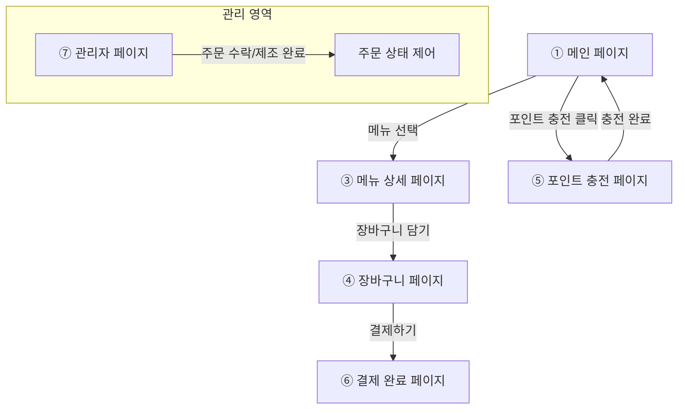

# ☕ jeonscafe 프로젝트 - 와이어프레임 및 요구사항 정의서

본 문서는 커피숍 주문 시스템(`jeonscafe`)의 필수 요구사항과 이를 반영한 와이어프레임 화면 설계를 정리한 문서입니다.

---

## 1. 📌 필수 요구사항 요약

### 1) 구현 대상 API
| 기능 | HTTP Method & URI | 설명 |
| :--- | :--- | :--- |
| **커피 메뉴 목록 조회** | `GET /menus` | 커피 메뉴 목록을 전체 조회합니다. |
| **포인트 충전하기** | `POST /points/charge` | 사용자 식별값과 금액을 받아 포인트를 충전합니다. |
| **커피 주문 및 결제** | `POST /orders` | 사용자 장바구니 품목을 결제하고 주문을 생성합니다. |
| **인기 메뉴 목록 조회** | `GET /menus/popular` | 최근 7일간 주문이 가장 많은 상위 3개 메뉴를 조회합니다. |

### 2) 핵심 비즈니스 로직
* **포인트 결제**: 결제는 오직 포인트로만 가능하며, 1원 = 1P로 처리됩니다. 주문 시 잔여 포인트를 확인하여 차감합니다.
* **실시간 데이터 전송**: 주문 완료 시, 주문 내역(사용자 ID, 메뉴 ID, 결제 금액 등)을 외부 수집 플랫폼으로 실시간 전송합니다 (Mock API 연동 혹은 메시지 전송 로직).

---

## 2. 🗺️ 화면 흐름도 (User Flow)

---

## 3. 📱 화면별 와이어프레임 구성 요소

### ① 메인 페이지
* **인기 메뉴 영역**: 최근 7일간의 인기 메뉴 TOP 3를 상단에 배치 (요구사항 4 반영)
* **전체 메뉴 목록**: 전체 커피 메뉴 목록 카드 (이미지, 메뉴명, 가격) (요구사항 1 반영)
* **상단 네비게이션**: 포인트 잔액 표시, 충전 페이지 링크, 장바구니 링크

### ② 로그인 / 회원가입 페이지
* **로그인**: 사용자 인증 기능
* **회원가입**: 신규 사용자 등록

### ③ 메뉴 상세 페이지
* **선택 옵션**: 온도(HOT / ICE), 수량 조절
* **장바구니 추가 버튼**: 장바구니 추가 후 계속 쇼핑하기 혹은 장바구니 페이지로 이동 팝업 노출

### ④ 장바구니 페이지
* **선택된 품목 리스트**: 수량 수정 및 삭제 기능
* **최종 결제 금액**: 포인트 결제액 합산 표시
* **결제하기 버튼**: 포인트 잔액이 부족하면 경고창 및 충전 페이지 링크 제공 (요구사항 3 반영)

### ⑤ 포인트 충전 페이지
* **잔여 포인트 실시간 조회**: 현재 회원의 보유 포인트 출력
* **충전 선택지**: 5,000P / 10,000P / 20,000P 버튼 및 사용자 직접 입력 (요구사항 2 반영)
* **충전하기 버튼**: 충전 API 호출

### ⑥ 결제 완료 페이지
* **주문 번호 및 결제 정보**: 주문 번호, 총 결제 포인트, 결제 일시 출력
* **이동 버튼**: 메인 페이지로 돌아가기

### ⑦ 관리자 페이지
* **주문 리스트**: 접수된 주문 건들의 상세 목록
* **상태 제어**: `제조 완료` 및 `픽업 완료` 버튼을 통해 주문의 상태를 동적으로 변경
