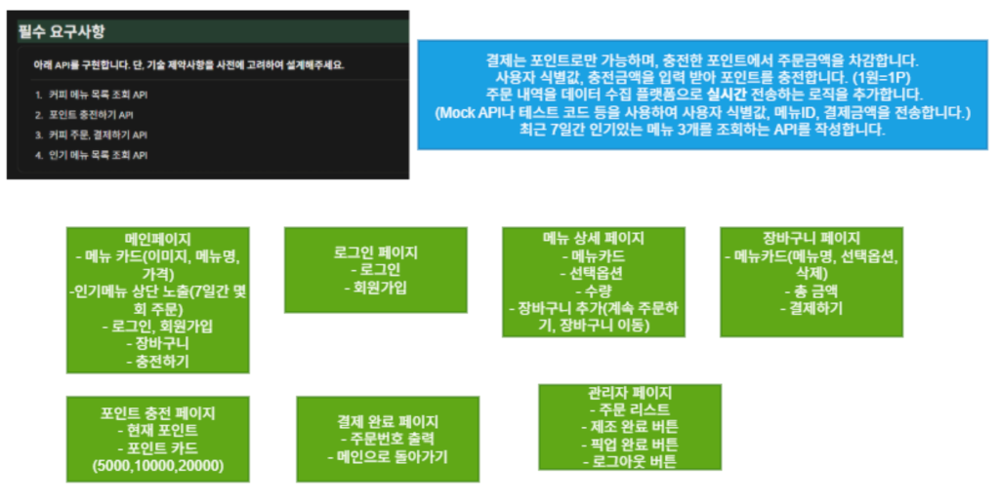

# 와이어프레임 및 화면 설계서

## 1. 와이어프레임 이미지

## 2. 필수 요구사항

### 2.1. 구현 대상 API
1. 커피 메뉴 목록 조회 API
2. 포인트 충전하기 API
3. 커피 주문, 결제하기 API
4. 인기 메뉴 목록 조회 API

### 2.2. 세부 제약사항 및 연동 규격
* 결제 방식
  * 결제는 포인트로만 가능하며, 충전한 포인트에서 주문금액을 차감합니다.
* 포인트 충전
  * 사용자 식별값, 충전금액을 입력 받아 포인트를 충전합니다. (1원 = 1P)
* 데이터 수집 플랫폼 연동
  * 주문 내역을 데이터 수집 플랫폼으로 실시간 전송하는 로직을 추가합니다.
  * Mock API나 테스트 코드 등을 사용하여 사용자 식별값, 메뉴ID, 결제금액을 전송합니다.
* 인기 메뉴 조회
  * 최근 7일간 인기있는 메뉴 3개를 조회하는 API를 작성합니다.

## 3. 화면별 구성 명세

### 3.1. 메인페이지
* 메뉴 카드
  * 이미지, 메뉴명, 가격 정보 노출
* 인기메뉴 상단 노출
  * 최근 7일간 몇 회 주문되었는지 횟수 포함
* 메뉴 네비게이션 및 기능
  * 로그인, 회원가입 기능 링크
  * 장바구니 이동
  * 포인트 충전하기

### 3.2. 로그인 페이지
* 로그인 폼
* 회원가입 링크

### 3.3. 메뉴 상세 페이지
* 메뉴카드 정보
* 선택옵션 설정
* 수량 설정
* 장바구니 추가 버튼
  * 클릭 시 계속 주문하기 또는 장바구니 이동을 선택할 수 있는 팝업/이동 경로 제공

### 3.4. 장바구니 페이지
* 선택한 메뉴 리스트 카드
  * 메뉴명, 선택옵션 노출 및 개별 삭제 버튼
* 총 결제 예정 금액 표시
* 결제하기 버튼

### 3.5. 포인트 충전 페이지
* 현재 잔여 포인트 조회
* 포인트 카드 선택 형태의 금액 충전 인터페이스
  * 선택 가능 금액 예시: 5000P, 10000P, 20000P

### 3.6. 결제 완료 페이지
* 최종 주문번호 출력
* 메인페이지로 돌아가기 버튼

### 3.7. 관리자 페이지
* 주문 목록 (주문 리스트) 조회
* 주문 단계 제어
  * 제조 완료 버튼
  * 픽업 완료 버튼
* 로그아웃 버튼
